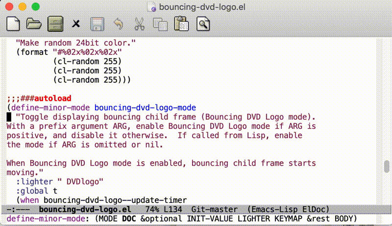

# bouncing-dvd-logo.el
bouncing-dvd-logo.el is a Emacs Lisp port of Bouncing DVD Logo.

## Screenshot


## Usage
Call command `M-x bouncing-dvd-logo-mode`.

## Customize
To turn bouncing frame's background color randomly (default):
```elisp
(setq bouncing-dvd-logo-background-color 'randomize)
```

To specify bouncing frame's background color:
```elisp
(setq bouncing-dvd-logo-background-color "gold")
```

To customize bouncing frame contents:
```elisp
;; To insert another string
(setq bouncing-dvd-logo-item "Hey")

;; To insert image
(setq bouncing-dvd-logo-item
      (lambda ()
        (insert-image (create-image "~/foo.png"))))
```

Caveat: don't insert too large image.

## Advanced
Bouncing frame is one [posframe](https://github.com/tumashu/posframe) frame, so you can dynamically modify contents.
```elisp
(add-hook 'org-mode-hook
	  #'(lambda ()
	      (when bouncing-dvd-logo-mode
		(with-current-buffer (get-buffer bouncing-dvd-logo--buf-name)
		  (erase-buffer)
		  (insert "\
  ___
 / _ \\ _ __ __ _
| | | | '__/ _` |
| |_| | | | (_| |
 \\___/|_|  \\__, |
           |___/")
		  (posframe-refresh bouncing-dvd-logo--buf-name)))))
```
